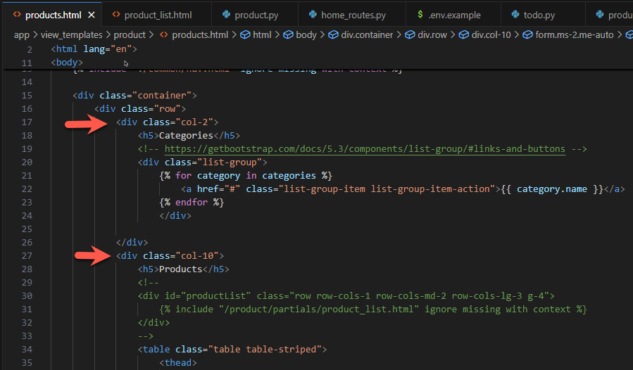
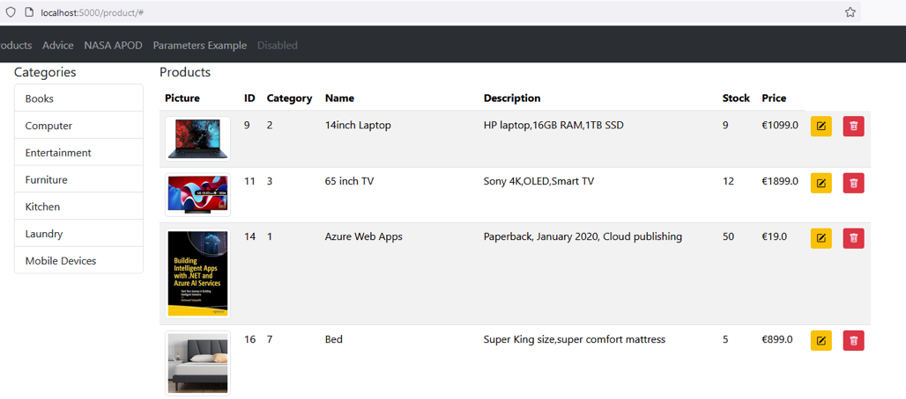

# Lab 11: Supabase Lab Exercises


### Getting started

**Start by cloning this repository and opening in VS Code.**

1. Configure the Python Virtual Environment

   `python -m venv venv --prompt="lab11"`

2. Activate the Virtual Environment

   `venv\Scripts\activate`

3. Install dependencies (note addition of `supabase`)

   `pip install fastapi uvicorn jinja2 python-multipart httpx supabase`

4. Setup the `.env` file, e.g. based on `.env.example` - you will need to add your Supabase URL and API Key

5. To run the application

   `uvicorn app.main:app --reload --port=5000`


## Introduction

The start site includes solutions to exercises from the previous lab. Products in a Supabase database can be added, updated, and deleted.

## Some Features explained

##### 1. The Product model

The `Product` model class has been updated to match the **product** table in Supabase.

* Note the `_` before `id` - this means it will be excluded if missing, for example when iserting a new product (as the new product id will be provided by the database)
* `@validator('thumbnail')` This is an example **Pydantic** validator which provides a default thumbnail image if none is provided. For more validator options, see https://docs.pydantic.dev/latest/concepts/validators/

`app/models/product.py`

```python
# A model class for Product items
# See https://docs.pydantic.dev/latest/concepts/models/

from pydantic import BaseModel, validator
from typing import Optional

class Product(BaseModel):
    _id: int # Pydantic excludes variables which begin with an underscore. 
    category_id: int
    title: str
    description: str
    price: float
    stock: int
    thumbnail: str = ""

    # https://docs.pydantic.dev/latest/concepts/validators/
    # if thumbnail missing, use a default
    @validator('thumbnail')
    def default_image(cls, v):
        assert v is not None, 'thumbnail image not supplied, using placeholder'
        if (v == "") :
            return("/static/images/product/placeholder.webp")
        return v
```

##### 2. Using the `Product` model for form data

Previously, when accepting form data, each form field was accepted as a separate parameter. In this example, the Product model is used instead to accept all the form data.
**This works because the form input names match the model attributes**

For example, the  `@router.post("/")` endpoint in `app/routes/product_routes.py`  accepts form data as a `Product` instance named **`productData`** (`productData: Annotated[Product, Form()]`)

```python
@router.post("/")
def postProduct(request: Request, productData: Annotated[Product, Form()]) :
    # get item value from the form POST data
    new_product = newProduct(productData)
    return templates.TemplateResponse("product/partials/product_tr.html", {"request": request, "product": new_product})
```

This method is also used when updating products.

##### 3. Displaying categories

Categories are displayed in the left side of the page - see `view_templates/product/products.html`. 

Note that Bootstrap organises page content into rows containing up to 12 columns. In this example, the 12 are divided 2 + 10. `<div class="col-2">` is used to display categories and `<div class="col-10">` for the products table.



The `categories` used here are passed from the `@router.get("/", response_class=HTMLResponse)` endpoint in `product_routes.py`. Note that it gets and passes a list of `categories` to the `products.html` template.

The result looks like this:




## Exercices

1. Show the category name instead of the id number in the products list. This will require a join query, see https://supabase.com/docs/guides/database/joins-and-nesting for an example.
1. In the add product form, use a select to allow category to be seated by name instead of requiring the category_id value.
1. When one of the category Links (left side of the page) is clicked, update the products list to only display products from that category.
